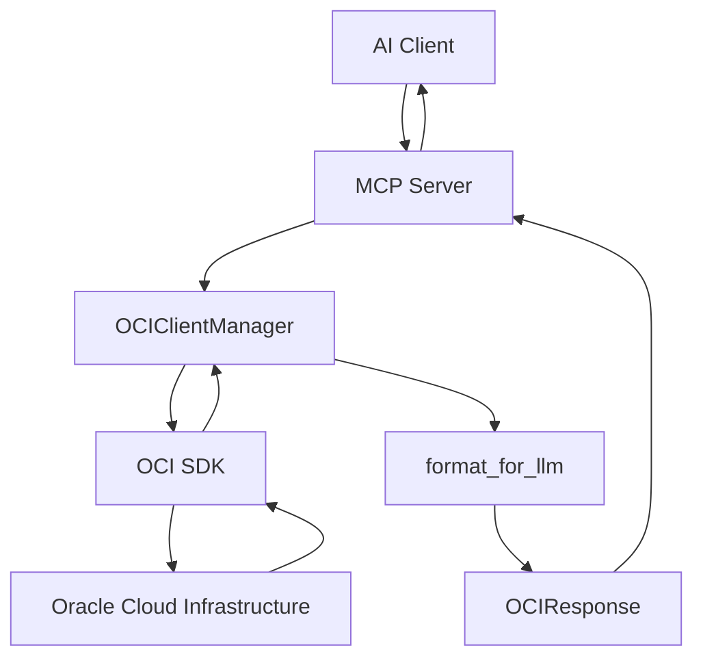

# OCI MCP Servers Architecture

## 🏗️ **System Overview**

The OCI MCP (Model Context Protocol) Servers provide a comprehensive interface for AI clients to interact with Oracle Cloud Infrastructure services. The architecture is designed for scalability, reliability, and optimal performance.

## 📁 **Project Structure**

```
mcp-oci/
├── src/
│   ├── mcp_oci_fastmcp/           # FastMCP optimized servers
│   │   ├── shared_architecture.py # Common components
│   │   ├── *_optimized.py        # Service-specific servers
│   │   └── __main__.py           # Entry point
│   ├── mcp_oci_*/                # Individual service packages
│   └── mcp_oci_rest/             # REST API implementations
├── docs/                         # Documentation
├── tests/                        # Test suites
├── scripts/                      # Utility scripts
├── archive/                      # Archived files
└── README.md                     # Main documentation
```

## 🔧 **Core Components**

### **1. Shared Architecture (`shared_architecture.py`)**

Centralized components used across all MCP servers:

- **`OCIClientManager`**: Singleton client manager with caching
- **`OCIResponse`**: Standardized response format
- **`validate_compartment_id()`**: Compartment ID validation
- **`get_log_analytics_namespace()`**: Auto-discovery of Log Analytics namespace
- **`format_for_llm()`**: Token-optimized data formatting
- **`handle_oci_error()`**: Comprehensive error handling
- **`create_common_tools()`**: Standard tools for all servers

### **2. Service-Specific Servers**

Each OCI service has an optimized FastMCP server:

- **Compute** (`compute_optimized.py`): Virtual machines, instances
- **IAM** (`iam_optimized.py`): Identity and access management
- **Usage API** (`usageapi_optimized.py`): Cost and usage tracking
- **Monitoring** (`monitoring_optimized.py`): Metrics and alarms
- **Networking** (`networking_optimized.py`): VCNs, subnets, security lists
- **Object Storage** (`objectstorage_optimized.py`): Buckets and objects
- **Database** (`database_optimized.py`): Autonomous databases, DB systems
- **Block Storage** (`blockstorage_optimized.py`): Block volumes
- **OKE** (`oke_optimized.py`): Kubernetes clusters
- **Functions** (`functions_optimized.py`): Serverless functions
- **Vault** (`vault_optimized.py`): Key management
- **Load Balancer** (`loadbalancer_optimized.py`): Load balancing
- **DNS** (`dns_optimized.py`): DNS management
- **KMS** (`kms_optimized.py`): Key management services
- **Events** (`events_optimized.py`): Event streaming
- **Streaming** (`streaming_optimized.py`): Message streaming
- **Log Analytics** (`loganalytics_optimized.py`): Log analysis

### **3. All-in-One Server (`server_optimized.py`)**

A comprehensive server that includes tools from all services in a single instance.

## 🚀 **Key Features**

### **Auto-Discovery**
- **Tenancy ID**: Automatically loaded from `~/.oci/config`
- **Root Compartment**: Used as default for all operations
- **Compartment Discovery**: Lists all accessible compartments
- **Log Analytics Namespace**: Auto-discovered for Log Analytics operations

### **Comprehensive Search**
- **Cross-Compartment Search**: Searches all accessible compartments by default
- **Filtered Search**: Supports filtering by lifecycle state, display name, etc.
- **Resource Search**: Uses OCI Resource Search API when available

### **Token Optimization**
- **Claude-Friendly Responses**: Structured JSON responses optimized for LLMs
- **Data Formatting**: Removes unnecessary fields to reduce token usage
- **Pagination**: Efficient handling of large result sets

### **Error Handling**
- **Graceful Degradation**: Continues operation even if some compartments fail
- **Detailed Error Messages**: Clear error reporting for debugging
- **Retry Logic**: Built-in retry mechanisms for transient failures

## 🔌 **Integration Patterns**

### **MCP Protocol**
All servers implement the Model Context Protocol (MCP) for AI client integration:

```python
@app.tool()
async def list_instances(
    compartment_id: str | None = None,
    lifecycle_state: str | None = None,
    limit: int = 50
) -> str:
    """List compute instances across all accessible compartments."""
    # Implementation using shared architecture
```

### **FastMCP Framework**
Built on FastMCP for high performance and reliability:

- **Async Operations**: Non-blocking I/O operations
- **Tool Registration**: Automatic tool discovery
- **Error Handling**: Comprehensive error management
- **Logging**: Structured logging for debugging

## 📊 **Data Flow**



## 🛠️ **Configuration**

### **OCI Configuration**
Servers use the standard OCI configuration file:

```ini
[DEFAULT]
tenancy=ocid1.tenancy.oc1..aaaaaaaaxzpxbcag7zgamh2erlggqro3y63tvm2rbkkjz4z2zskvagupiz7a
user=ocid1.user.oc1..aaaaaaaaxzpxbcag7zgamh2erlggqro3y63tvm2rbkkjz4z2zskvagupiz7a
fingerprint=xx:xx:xx:xx:xx:xx:xx:xx:xx:xx:xx:xx:xx:xx:xx:xx
key_file=~/.oci/oci_api_key.pem
region=eu-frankfurt-1
```

### **Environment Variables**
- `OCI_PROFILE`: OCI profile to use (default: DEFAULT)
- `OCI_REGION`: OCI region override

## 🧪 **Testing**

### **Test Structure**
```
tests/
├── integration/          # Integration tests
│   ├── test_compute.py   # Compute service tests
│   ├── test_iam.py       # IAM service tests
│   └── test_usageapi.py  # Usage API tests
└── unit/                 # Unit tests
    └── test_shared.py    # Shared architecture tests
```

### **Test Execution**
```bash
# Run all tests
python -m pytest tests/

# Run specific service tests
python -m pytest tests/integration/test_compute.py

# Run with coverage
python -m pytest --cov=src tests/
```

## 📈 **Performance Optimizations**

### **Caching**
- **Client Caching**: OCI clients are cached and reused
- **Config Caching**: Configuration is cached with TTL
- **Response Caching**: Frequently accessed data is cached

### **Parallel Operations**
- **Concurrent Compartment Search**: Multiple compartments searched in parallel
- **Async I/O**: Non-blocking operations throughout
- **Batch Processing**: Efficient handling of large datasets

### **Token Optimization**
- **Field Filtering**: Only essential fields included in responses
- **Data Compression**: Optimized data structures
- **Pagination**: Efficient handling of large result sets

## 🔒 **Security**

### **Authentication**
- **OCI SDK Authentication**: Uses standard OCI authentication
- **Config File Security**: Private keys stored securely
- **No Hardcoded Credentials**: All credentials from config files

### **Authorization**
- **Compartment-Level Access**: Respects OCI IAM policies
- **Service-Level Permissions**: Each service requires appropriate permissions
- **Error Handling**: Graceful handling of permission errors

## 🚀 **Deployment**

### **Local Development**
```bash
# Install dependencies
pip install -e .

# Run individual service
python -m mcp_oci_fastmcp compute --profile DEFAULT --region eu-frankfurt-1

# Run all-in-one server
python -m mcp_oci_fastmcp optimized --profile DEFAULT --region eu-frankfurt-1
```

### **Docker Deployment**
```bash
# Build image
docker build -t mcp-oci .

# Run container
docker run -v ~/.oci:/root/.oci mcp-oci compute
```

### **Claude Desktop Integration**
```json
{
  "mcpServers": {
    "oci-compute": {
      "command": "python",
      "args": ["-m", "mcp_oci_fastmcp", "compute", "--profile", "DEFAULT", "--region", "eu-frankfurt-1"]
    },
    "oci-usageapi": {
      "command": "python",
      "args": ["-m", "mcp_oci_fastmcp", "usageapi", "--profile", "DEFAULT", "--region", "eu-frankfurt-1"]
    }
  }
}
```

## 📚 **API Reference**

### **Common Tools**
All servers include these common tools:

- `get_server_info()`: Server information and status
- `list_compartments()`: List accessible compartments
- `get_compartment_guidance()`: Compartment selection guidance

### **Service-Specific Tools**
Each service provides tools specific to its functionality:

- **Compute**: `list_instances()`, `get_instance()`, `list_stopped_instances()`
- **IAM**: `list_users()`, `list_groups()`, `list_policies()`
- **Usage API**: `list_usage_summaries()`, `get_usage_summary()`
- **Monitoring**: `list_metrics()`, `list_alarms()`, `summarize_metrics_data()`

## 🔄 **Maintenance**

### **Regular Updates**
- **OCI SDK Updates**: Keep OCI Python SDK updated
- **FastMCP Updates**: Update FastMCP framework
- **Security Updates**: Regular security patches

### **Monitoring**
- **Log Analysis**: Monitor server logs for errors
- **Performance Metrics**: Track response times and throughput
- **Error Rates**: Monitor error rates and types

## 🎯 **Best Practices**

### **Development**
- **Use Shared Architecture**: Leverage common components
- **Follow Naming Conventions**: Consistent naming across services
- **Error Handling**: Comprehensive error handling
- **Testing**: Write tests for all functionality

### **Operations**
- **Monitor Performance**: Track server performance
- **Log Analysis**: Regular log analysis
- **Backup Configuration**: Backup OCI configuration
- **Security Updates**: Keep dependencies updated

## 📞 **Support**

For issues and questions:
- **Documentation**: Check the `docs/` directory
- **Issues**: Create GitHub issues for bugs
- **Discussions**: Use GitHub discussions for questions
- **OCI Support**: Contact Oracle Cloud Support for OCI-specific issues

---

**Last Updated**: September 15, 2025  
**Version**: 2.0  
**Status**: Production Ready
