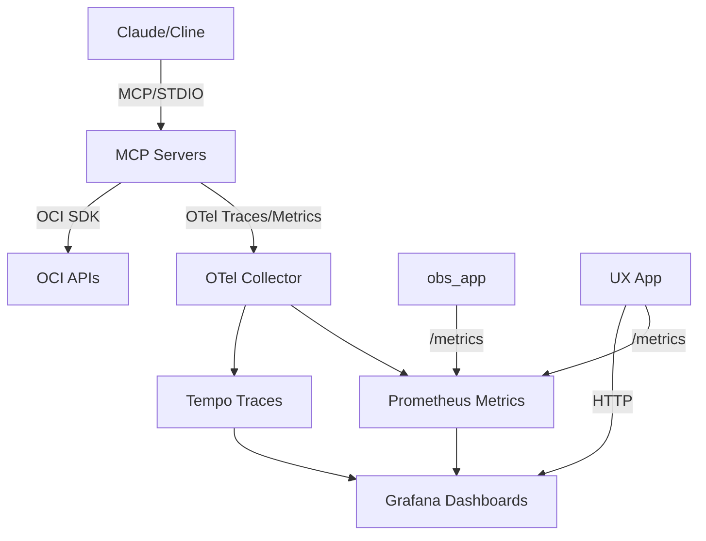

# OCI MCP for OCI + Observability (Production-Ready)

## Overview
Production-ready MCP servers for Oracle Cloud Infrastructure (OCI), including a consolidated Observability server that exposes Log Analytics tools. The project follows MCP server best practices and adds in-process caching and a shared name→OCID registry to reduce API calls and token usage.

Key features:
- Single consolidated Observability server (oci-mcp-observability) with Log Analytics and observability helpers.
- Individual MCP servers for IAM, Compute, Networking, Object Storage, etc.
- Deterministic, idempotent behavior; explicit confirmation for destructive actions.
- Name→OCID registry populated by list calls; subsequent name-based requests avoid backend calls.
- Tunable cache TTLs per service; secrets are never committed (see .gitignore).

## Installation
Option A (one-shot):
```
scripts/deploy.sh
```

Option B (manual):
```
python -m venv .venv
source .venv/bin/activate
pip install -U pip
pip install -e .[dev]
make lint
make test
```

## Configuration
Set OCI credentials in `~/.oci/config`. Optionally set defaults:
```
export OCI_PROFILE=DEFAULT
export OCI_REGION=eu-frankfurt-1
```

## Quickstart

### 1-Click Local Run for Observability Stack

To quickly start the observability stack (Grafana, Prometheus, Tempo, OTEL Collector, obs_app):

```
cd ops
docker compose up -d
```

This provides monitoring and tracing. Access Grafana at http://localhost:3000 (admin/admin).

### Launching MCP Servers

Run each server in a separate terminal (or use tmux/screen):

```
poetry run python mcp_servers/compute/server.py
poetry run python mcp_servers/db/server.py
poetry run python mcp_servers/network/server.py
poetry run python mcp_servers/security/server.py
poetry run python mcp_servers/observability/server.py   # Consolidated server (includes Log Analytics)
poetry run python mcp_servers/cost/server.py
poetry run python mcp_servers/blockstorage/server.py
poetry run python mcp_servers/loadbalancer/server.py
```

Alternatively, use the launcher script for all:

```
scripts/mcp-launchers/start-mcp-server.sh all
```

### Adding to Claude Desktop / Cline

For Claude Desktop: Edit claude_desktop_config.json and add MCP server entries from mcp.json under "mcp_servers".

For Cline: In cline_mcp_settings.json, add:

```json
"mcp_servers": [  // paste array from mcp.json ]
```

STDIO command definitions are in mcp.json, e.g.:

```json
{
  "name": "oci-mcp-compute",
  "command": ["python", "-m", "mcp_servers.compute.server"],
  "args": [],
  "env": { "OCI_PROFILE": "${OCI_PROFILE}", "OCI_REGION": "${OCI_REGION}", "COMPARTMENT_OCID": "${COMPARTMENT_OCID}" },
  "transport": "stdio"
}
```

### Infrastructure Creation & Management

**⚠️ Safety First**: All creation operations require `ALLOW_MUTATIONS=true` environment variable.

#### Example Creation Prompts:
- "Create a VCN with CIDR 10.0.0.0/16 in my compartment"
- "Create a subnet in VCN ocid1.vcn..example with CIDR 10.0.1.0/24"
- "Launch a VM.Standard.E2.1.Micro compute instance in subnet ocid1.subnet..example"
- "Create a 100GB block volume in availability domain AD-1"
- "Set up a load balancer with listeners for my web application"

### Example Prompts for Claude

- "List my instances in compartment ocid1.compartment.oc1..example and start ocid1.instance.oc1.example"
- "Create a complete infrastructure stack: VCN, subnet, VM, and load balancer"
- "Run Log Analytics query using the oci:loganalytics:execute_query tool (auto-discovers namespace)"
- "Show Grafana dashboard and a trace in Tempo"
- "Run cost anomaly on series [100, 200, 150, 500, 180]"
- "Summarize open Cloud Guard problems in last 24h"
- "List my block volumes and create a new 50GB volume"

## Architecture & Data Flow



## Demo Script (5-7 min flow)

1. In Claude (with MCP): Ask to list instances and start one.
2. Run a Log Analytics query (e.g., `oci:loganalytics:execute_query`) or list sources.
3. Visit UX at localhost:8000 to see servers and relations.
4. Navigate to /dashboards to view embedded Grafana.
5. In Tempo (Grafana), search for a trace from obs_app.
6. Run cost anomaly tool on a sample series.
7. Summarize Cloud Guard open problems.

## Example Workflows

### Workflow 1: Compute Management
- Prompt: "List running instances in my compartment and provide CPU metrics for the last hour."
- Expected: Uses compute list + metrics tools; outputs summary.

### Workflow 2: Security Check
- Prompt: "Scan for open Cloud Guard problems and Data Safe findings."
- Expected: Aggregates security posture.

### Workflow 3: Cost Analysis
- Prompt: "Get cost breakdown for last week and detect anomalies."
- Expected: Usage report + anomaly flags.

### Workflow 4: Log Query & Observe
- Prompt: "Run LA query for errors in last 24h; check traces in Tempo."
- Expected: Query results + navigation to traces.

Polish notes:
- All servers tested with unit tests.
- Env vars documented in .env.example.
- For production, deploy obs_app to OCI Container Instances.
## Performance & Token Optimization
- Registry: list operations populate a name→OCID registry (compartments, VCNs, subnets, instances, users, etc.). Subsequent name-based calls resolve locally without API requests.
- Caching: per-service caches with tunable TTLs (seconds):
  - Global: `MCP_CACHE_TTL` (default 3600)
  - Service overrides: `MCP_CACHE_TTL_COMPUTE`, `..._NETWORKING`, `..._IAM` (users cached 6h), `..._OKE`, `..._FUNCTIONS`, `..._STREAMING`, `..._OBJECTSTORAGE`, `..._LOADBALANCER`
- Warm helpers:
  - `mcp:warm:services` — warms global resources (compartments, users, buckets, vcns, etc.)
  - `mcp:warm:compartment` — warms a specific compartment (vcns→subnets, instances, lbs, functions, streams)
  - CLI: `scripts/warm_registry.py --profile DEFAULT --region eu-frankfurt-1 --limit 20`

## Observability helpers
- `oci:observability:get-recent-calls` — last 50 MCP calls with full path (server→tool→SDK) and success flag.
- `oci:observability:clear-recent-calls` — clear the buffer.

## Security & Secrets
- No secrets are committed. `.env` is git-ignored. SDK credentials are read from `~/.oci/config` or instance principals.
- Logging redacts sensitive info and does not echo credentials.

## Development
- Lint/format: `make lint` / `make fmt`
- Tests: `make test`
- Launch servers via `python mcp_servers/<service>/server.py` or use entries in `mcp.json`.
