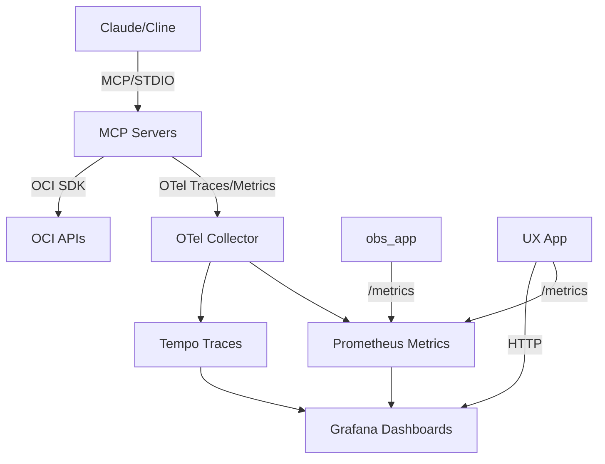

# OCI AI + Observability Demo

## Quickstart

### 1-Click Local Run for Observability Stack

To quickly start the observability stack (Grafana, Prometheus, Tempo, OTEL Collector, obs_app):

```
cd ops
docker compose up -d
```

This provides monitoring and tracing. Access Grafana at http://localhost:3000 (admin/admin).

### Launching MCP Servers

Run each server in a separate terminal (or use tmux/screen):

```
poetry run python mcp_servers/compute/server.py
poetry run python mcp_servers/db/server.py
poetry run python mcp_servers/network/server.py
poetry run python mcp_servers/security/server.py
poetry run python mcp_servers/observability/server.py
poetry run python mcp_servers/cost/server.py
```

Alternatively, use the launcher script for all:

```
scripts/mcp-launchers/start-mcp-server.sh all
```

### Adding to Claude Desktop / Cline

For Claude Desktop: Edit claude_desktop_config.json and add MCP server entries from mcp.json under "mcp_servers".

For Cline: In cline_mcp_settings.json, add:

```json
"mcp_servers": [  // paste array from mcp.json ]
```

STDIO command definitions are in mcp.json, e.g.:

```json
{
  "name": "oci-mcp-compute",
  "command": ["python", "-m", "mcp_servers.compute.server"],
  "args": [],
  "env": { "OCI_PROFILE": "${OCI_PROFILE}", "OCI_REGION": "${OCI_REGION}", "COMPARTMENT_OCID": "${COMPARTMENT_OCID}" },
  "transport": "stdio"
}
```

### Example Prompts for Claude

- "List my instances in compartment ocid1.compartment.oc1..example and start ocid1.instance.oc1.example"
- "Run Log Analytics query: 'search \"error\" | summarize count() by source'"
- "Show Grafana dashboard and a trace in Tempo"
- "Run cost anomaly on series [100, 200, 150, 500, 180]"
- "Summarize open Cloud Guard problems in last 24h"

## Data Flows Diagram



## Demo Script (5-7 min flow)

1. In Claude (with MCP): Ask to list instances and start one.
2. Run a Log Analytics query (e.g., list sources).
3. Visit UX at localhost:8000 to see servers and relations.
4. Navigate to /dashboards to view embedded Grafana.
5. In Tempo (Grafana), search for a trace from obs_app.
6. Run cost anomaly tool on a sample series.
7. Summarize Cloud Guard open problems.

## Example Workflows

### Workflow 1: Compute Management
- Prompt: "List running instances in my compartment and provide CPU metrics for the last hour."
- Expected: Uses compute list + metrics tools; outputs summary.

### Workflow 2: Security Check
- Prompt: "Scan for open Cloud Guard problems and Data Safe findings."
- Expected: Aggregates security posture.

### Workflow 3: Cost Analysis
- Prompt: "Get cost breakdown for last week and detect anomalies."
- Expected: Usage report + anomaly flags.

### Workflow 4: Log Query & Observe
- Prompt: "Run LA query for errors in last 24h; check traces in Tempo."
- Expected: Query results + navigation to traces.

Polish notes:
- All servers tested with unit tests.
- Env vars documented in .env.example.
- For production, deploy obs_app to OCI Container Instances.
